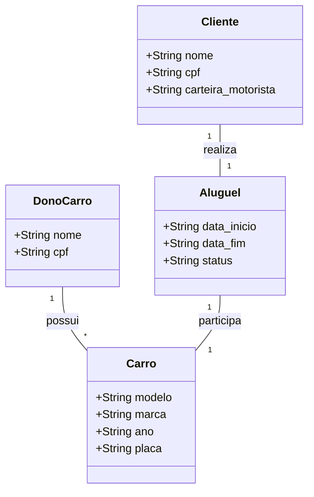

# DIO - Desafio API com Springboot

Desenvolvi uma API de um sistema de Aluguel de carros, aplicando os conhecimentos que foram aprendidos durante bootcamp

Diagrama de Classes da API

```mermaid
classDiagram
    class DonoCarro {
        +String nome
        +String cpf
    }

    class Cliente {
        +String nome
        +String cpf
        +String carteira_motorista
    }

    class Carro {
        +String modelo
        +String marca
        +String ano
        +String placa
    }

    class Aluguel {
        +String data_inicio
        +String data_fim
        +String status
    }

    DonoCarro "1" -- "*" Carro : possui
    Cliente "1" -- "1" Aluguel : realiza
    Aluguel "1" -- "1" Carro : participa
```
